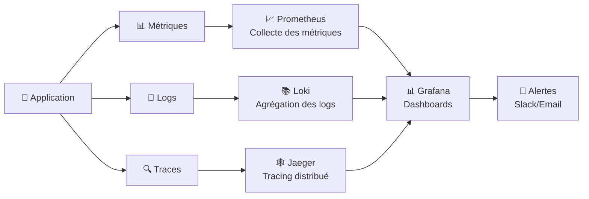
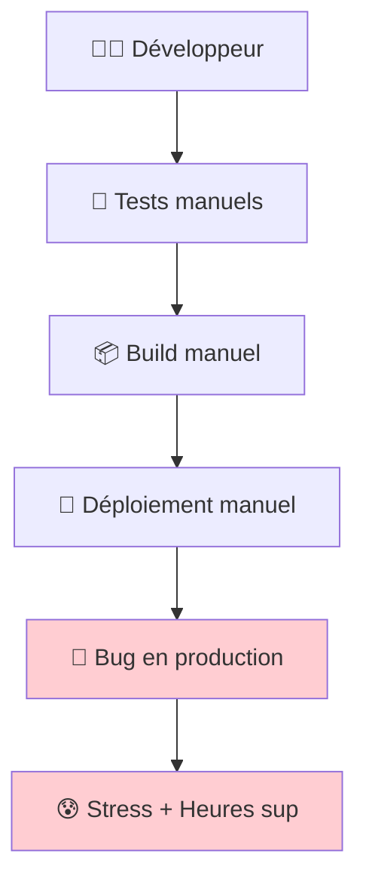
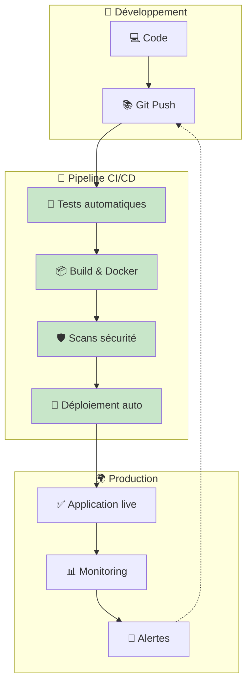
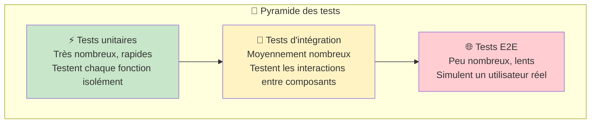
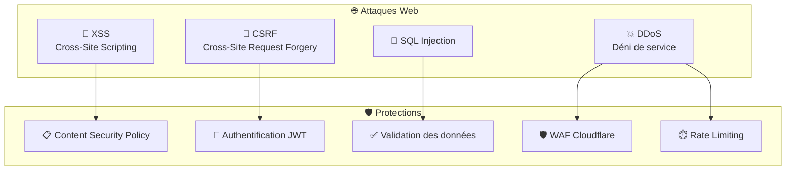
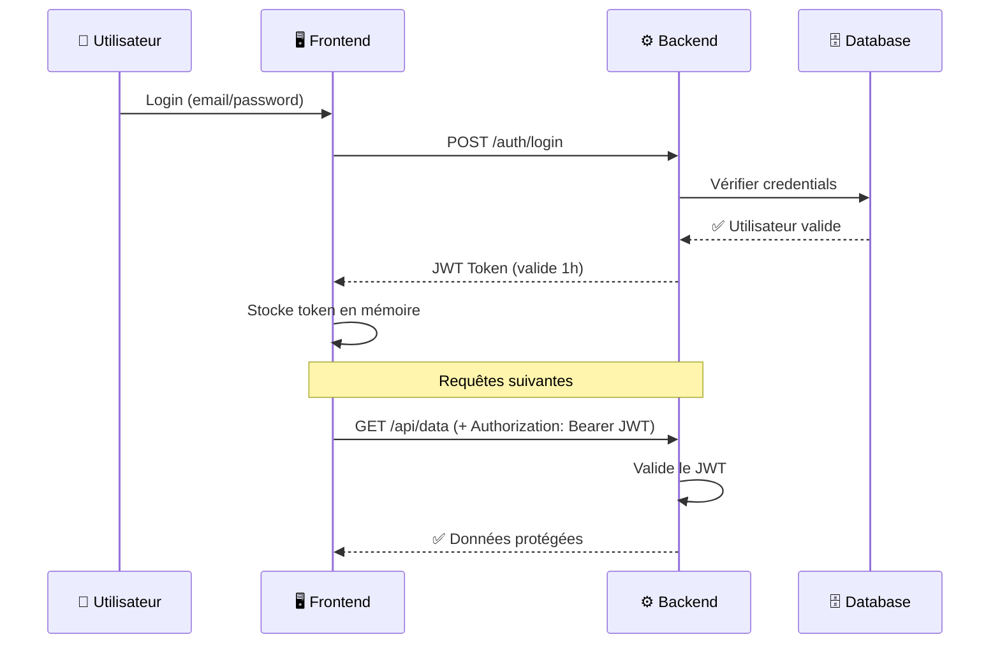
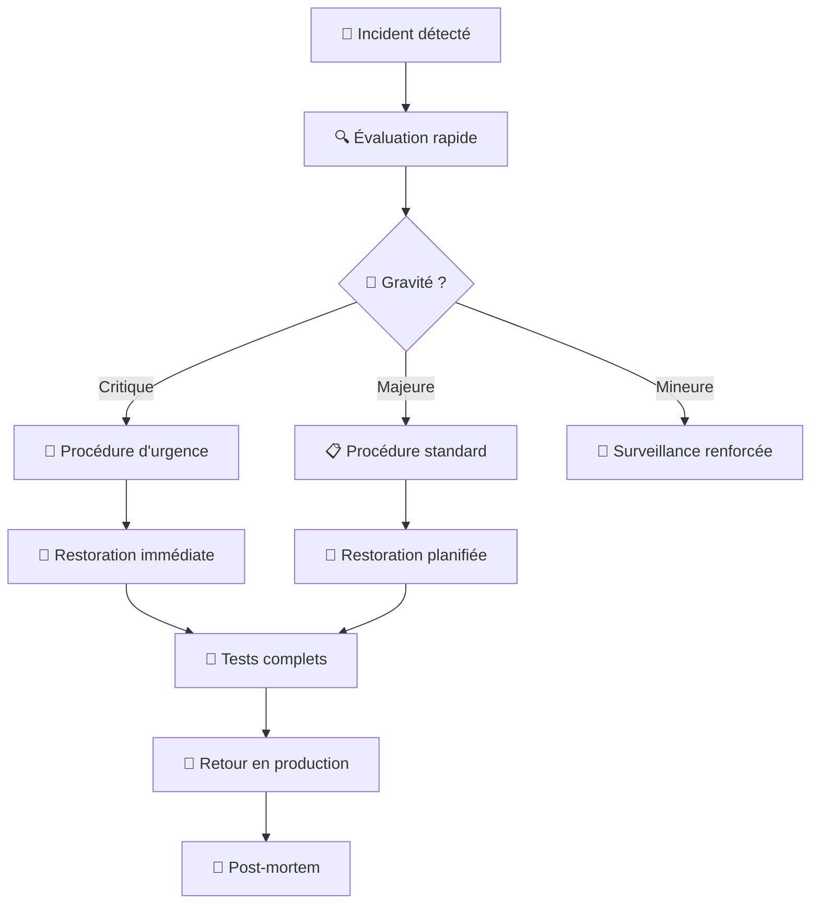

# Aller plus loin

## Concepts avancés du développement web moderne

Maintenant que tu as compris les bases de WoW Perf, explorons les concepts plus avancés qui permettent de créer des applications robustes, sécurisées et maintenables en production.

---

## 📊 Monitoring et Logs

### Pourquoi surveiller son application ?

Imagine que ton application soit une voiture. Le monitoring, c'est comme le tableau de bord qui te dit :

- À quelle vitesse tu roules (performance)
- S'il y a un problème moteur (erreurs)
- Combien de carburant il reste (ressources)



### Les outils de monitoring

#### 📈 Prometheus + Grafana (Les métriques)

- **Prometheus** : Collecte les données (CPU, mémoire, requêtes/seconde)
- **Grafana** : Crée de beaux graphiques et dashboards
- **Exemples de métriques importantes :**
  - Temps de réponse de l'API
  - Nombre d'utilisateurs connectés
  - Utilisation de la base de données
  - Erreurs par minute

#### 📝 Logs centralisés (ELK Stack)

- **Elasticsearch** : Stocke et indexe les logs
- **Logstash** : Traite et transforme les logs
- **Kibana** : Interface pour rechercher et analyser

**Exemple de log structuré :**

```json
{
  "timestamp": "2025-06-09T10:30:00Z",
  "level": "ERROR",
  "service": "backend",
  "user_id": "123",
  "action": "search_player",
  "error": "Player not found: Arthas",
  "duration_ms": 250
}
```

#### 🔍 Tracing distribué (Jaeger)

Suit une requête à travers tous les services :

1. Frontend → Traefik (2ms)
2. Traefik → Backend (1ms)
3. Backend → PostgreSQL (45ms)
4. Backend → Cache Redis (0.5ms)

**Total : 48.5ms** - Tu peux voir où ça ralentit !

---

## 🔄 CI/CD (Intégration et Déploiement Continus)

### Le problème sans CI/CD



### La solution : Pipeline automatisé



### GitHub Actions (Exemple de pipeline)

```yaml
name: Deploy WoW Perf
on:
  push:
    branches: [main]

jobs:
  test:
    runs-on: ubuntu-latest
    steps:
      - name: Tests Frontend
        run: npm test
      - name: Tests Backend
        run: go test ./...

  deploy:
    needs: test
    runs-on: ubuntu-latest
    steps:
      - name: Build Docker images
      - name: Deploy to production
      - name: Health check
```

**Avantages :**

- ✅ Zéro intervention manuelle
- ✅ Tests automatiques avant chaque déploiement
- ✅ Rollback automatique si problème
- ✅ Déploiements plus fréquents et sûrs

---

## 🧪 Stratégie de Testing

### La pyramide des tests



### Types de tests dans WoW Perf

#### ⚡ Tests unitaires (70% des tests)

**Backend Go :**

```go
func TestCalculatePerformanceScore(t *testing.T) {
    player := &Player{DPS: 15000, ItemLevel: 385}
    score := CalculateScore(player)
    assert.Equal(t, 8.5, score)
}
```

**Frontend React :**

```javascript
test("affiche le nom du joueur", () => {
  render(<PlayerCard name="Arthas" />);
  expect(screen.getByText("Arthas")).toBeInTheDocument();
});
```

#### 🔗 Tests d'intégration (20% des tests)

- Test complet API → Base de données
- Test de l'authentification
- Test des workflows Temporal

#### 🌐 Tests End-to-End (10% des tests)

Avec Playwright ou Cypress :

```javascript
test("recherche un joueur", async ({ page }) => {
  await page.goto("https://wowperf.com");
  await page.fill("[data-testid=search]", "Arthas");
  await page.click("[data-testid=search-btn]");
  await expect(page.locator(".player-stats")).toBeVisible();
});
```

---

## 🛡️ Sécurité

### Les menaces principales



### Authentification et autorisation

#### 🔐 Flow d'authentification JWT



### Validation des données

**Backend (Go) :**

```go
type CreatePlayerRequest struct {
    Name   string `json:"name" validate:"required,min=2,max=20"`
    Realm  string `json:"realm" validate:"required"`
    Region string `json:"region" validate:"required,oneof=EU US"`
}
```

**Frontend (React) :**

```javascript
const schema = z.object({
  name: z.string().min(2).max(20),
  realm: z.string().min(1),
  region: z.enum(["EU", "US"]),
});
```

---

## 💾 Stratégie de Backup

### Types de sauvegardes

```mermaid
graph TB
    subgraph "💾 Données à sauvegarder"
        DB[(🗄️ PostgreSQL<br/>Données utilisateurs)]
        Files[📁 Fichiers statiques<br/>Images, uploads]
        Config[⚙️ Configuration<br/>Docker Compose, env]
        Code[💻 Code source<br/>Git repositories]
    end

    subgraph "📦 Stratégies de backup"
        DB --> DBBackup[🔄 Dump SQL quotidien]
        Files --> FileBackup[📂 Sync fichiers]
        Config --> ConfigBackup[⚙️ Backup config]
        Code --> Git[📚 Git (déjà sauvé)]
    end

    subgraph "☁️ Stockage"
        DBBackup --> S3[🪣 AWS S3<br/>Rétention 30 jours]
        FileBackup --> S3
        ConfigBackup --> S3
    end

    subgraph "🚨 Monitoring backup"
        S3 --> Health[✅ Vérification quotidienne]
        Health --> Alert[🚨 Alerte si échec]
    end
```

### Script de sauvegarde automatique

```bash
#!/bin/bash
# Backup quotidien de PostgreSQL

DATE=$(date +%Y%m%d_%H%M%S)
BACKUP_DIR="/backups"
DB_NAME="wowperf"

# Dump de la base
docker exec postgres pg_dump -U postgres $DB_NAME | gzip > \
  $BACKUP_DIR/wowperf_$DATE.sql.gz

# Upload vers S3
aws s3 cp $BACKUP_DIR/wowperf_$DATE.sql.gz \
  s3://wowperf-backups/db/

# Nettoyage des backups locaux > 7 jours
find $BACKUP_DIR -name "*.sql.gz" -mtime +7 -delete

# Vérification
if [ $? -eq 0 ]; then
    echo "✅ Backup réussi: $DATE"
else
    echo "❌ Échec backup: $DATE" | mail -s "Backup Failed" admin@wowperf.com
fi
```

### Plan de récupération (Disaster Recovery)

#### 🔥 Scénarios de panne

1. **Panne serveur** → Migration vers nouveau VPS (2h)
2. **Corruption base de données** → Restore depuis backup (30min)
3. **Piratage** → Restore + audit sécurité (4h)
4. **Datacenter en feu** → Redéploiement complet (6h)

#### 📋 Checklist de récupération



---

## 🔮 Concepts avancés pour aller encore plus loin

### 🏗️ Architecture Microservices

Diviser l'application en services indépendants :

- Service Authentification
- Service Joueurs
- Service Guildes
- Service Analytics

### 📊 Event Sourcing

Stocker tous les événements plutôt que l'état final :

- `PlayerCreated`
- `StatsUpdated`
- `GuildJoined`

### 🌍 Multi-région

Déployer l'application dans plusieurs datacenters pour :

- Réduire la latence
- Améliorer la disponibilité
- Respecter les réglementations locales

### 🤖 Intelligence Artificielle

Ajouter de l'IA pour :

- Prédire les performances des joueurs
- Recommander des améliorations d'équipement
- Détecter les comportements anormaux

---

## 🎯 Questions pour approfondir

1. **Monitoring** : Comment détecter qu'un utilisateur rencontre des lenteurs ?
2. **CI/CD** : Que faire si un déploiement automatique casse la production ?
3. **Tests** : Quand est-ce qu'on a "assez" de tests ?
4. **Sécurité** : Comment équilibrer sécurité et expérience utilisateur ?
5. **Backups** : Comment tester qu'une sauvegarde fonctionne vraiment ?

---

## 🚀 Prochaines étapes pratiques

1. **Mettre en place Grafana** pour voir les métriques en temps réel
2. **Créer un pipeline CI/CD simple** avec GitHub Actions
3. **Écrire tes premiers tests** unitaires et d'intégration
4. **Configurer des alertes** pour être notifié des problèmes
5. **Automatiser les backups** et tester une restoration

Le développement web moderne, c'est bien plus que du code - c'est tout un écosystème pour créer des applications robustes et pérennes ! 🌟
