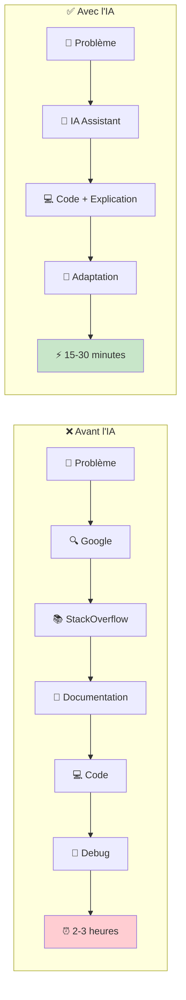
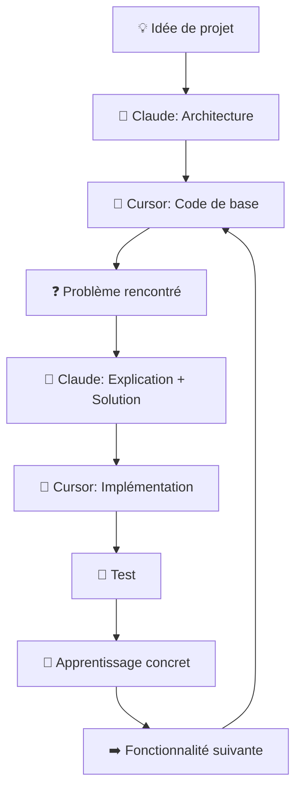
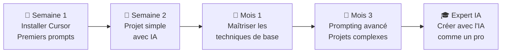

# Guide d'initiation à l'IA pour développeurs

## Cursor, Claude et l'art du prompting efficace

Bienvenue dans l'ère de l'IA ! Ce guide va t'apprendre à utiliser l'intelligence artificielle comme un véritable superpouvoir de développement. Tu vas découvrir comment Cursor peut révolutionner ton coding et comment bien interagir avec Claude pour résoudre tes problèmes techniques.

---

## 🤖 Pourquoi l'IA change tout pour les développeurs

### 🚀 L'IA comme accélérateur



### 🎯 L'IA n'est PAS là pour remplacer les développeurs

**L'IA t'aide à :**

- ✅ Générer du code de base rapidement
- ✅ Débugger et expliquer les erreurs
- ✅ Apprendre de nouveaux concepts
- ✅ Optimiser ton code existant
- ✅ Gérer les tâches répétitives

**Mais tu restes ESSENTIEL pour :**

- 🧠 La logique métier et l'architecture
- 🎯 Comprendre les besoins utilisateur
- 🔍 Valider et tester le code généré
- 🚀 L'innovation et la créativité
- 🤝 La collaboration en équipe

---

## 🎨 Cursor : Ton éditeur de code surpowered

### 📥 Installation de Cursor

**Cursor est un fork de VS Code avec l'IA intégrée nativement.**

1. **Va sur :** https://cursor.sh/
2. **Télécharge** la version Windows
3. **Installe** comme VS Code (même processus)
4. **Import tes settings VS Code :** Cursor peut importer ta config VS Code automatiquement

### ⚙️ Configuration initiale

**Premier lancement :**

1. **Connexion :** Crée un compte Cursor (gratuit avec limitations, payant pour usage intensif)
2. **Import VS Code :** Cursor propose d'importer tes extensions et settings
3. **Choix du modèle IA :**
   - **GPT-4** : Le plus puissant (recommandé)
   - **Claude-3.5-Sonnet** : Excellent pour le code
   - **GPT-3.5** : Plus rapide, moins précis

### 🔥 Fonctionnalités principales de Cursor

#### 💬 Chat avec ton code (Ctrl+L)

```python
# Tu sélectionnes ce code bugué
def calculate_average(numbers):
    total = 0
    for num in numbers:
        total += num
    return total / len(numbers)  # ❌ Division par zéro possible !

# Tu demandes dans le chat Cursor :
# "Ce code a un bug, peux-tu le corriger et expliquer le problème ?"
```

**Cursor va :**

1. Identifier le bug (division par zéro)
2. Proposer une correction
3. Expliquer pourquoi c'était problématique

#### ⚡ Code generation (Ctrl+K)

**Exemple pratique :**

```javascript
// Tu écris juste ce commentaire :
// Crée une fonction qui valide une adresse email avec regex

// Puis Ctrl+K, et Cursor génère :
function validateEmail(email) {
  const emailRegex = /^[^\s@]+@[^\s@]+\.[^\s@]+$/;
  return emailRegex.test(email);
}
```

#### 🔍 Explain code (Ctrl+Shift+L)

Sélectionne n'importe quel morceau de code complexe, et Cursor t'explique ligne par ligne ce qu'il fait.

#### 🧪 Generate tests

```python
# Tu as cette fonction :
def fibonacci(n):
    if n <= 1:
        return n
    return fibonacci(n-1) + fibonacci(n-2)

# Tu demandes : "Génère des tests unitaires pour cette fonction"
# Cursor crée automatiquement :
import unittest

class TestFibonacci(unittest.TestCase):
    def test_fibonacci_base_cases(self):
        self.assertEqual(fibonacci(0), 0)
        self.assertEqual(fibonacci(1), 1)

    def test_fibonacci_recursive_cases(self):
        self.assertEqual(fibonacci(5), 5)
        self.assertEqual(fibonacci(10), 55)
```

### 💡 Conseils pour bien utiliser Cursor

#### ✅ DO (Bonnes pratiques)

- **Sois spécifique :** "Crée une fonction Python qui valide un mot de passe avec au moins 8 caractères, 1 majuscule, 1 chiffre"
- **Donne du contexte :** "Dans le cadre d'une API REST Flask..."
- **Demande des explications :** "Explique-moi chaque étape de ce code"
- **Itère :** "Maintenant ajoute la gestion d'erreurs à cette fonction"

#### ❌ DON'T (À éviter)

- **Prompts vagues :** "Fais une fonction"
- **Confiance aveugle :** Toujours tester le code généré
- **Copier-coller sans comprendre :** Assure-toi de comprendre ce que fait le code
- **Oublier la sécurité :** L'IA ne pense pas toujours aux failles de sécurité

---

## 💬 Claude : Ton mentor technique personnel

### 🎯 Comment bien utiliser Claude en conversation

Claude (moi !) est parfait pour :

- 🧠 Apprendre des concepts techniques
- 🔍 Débugger des problèmes complexes
- 📚 Expliquer des technologies
- 🏗️ Concevoir des architectures
- 📝 Revoir et améliorer ton code

### 📝 Techniques de prompting pour Claude

#### 🎯 Structure d'un bon prompt

```
[CONTEXTE] + [DEMANDE PRÉCISE] + [FORMAT SOUHAITÉ] + [CONTRAINTES]
```

**Exemple concret :**

❌ **Mauvais prompt :**
"Comment faire une API ?"

✅ **Bon prompt :**
"Je suis débutant en Python et je veux créer une API REST simple avec Flask pour gérer une liste de tâches (CRUD). Peux-tu me donner :

1. Le code de base avec les routes
2. Un exemple de structure de données
3. Les étapes pour tester l'API avec curl
   Contrainte : pas de base de données, juste stockage en mémoire."

#### 🔥 Techniques de prompting avancées

##### 1. **Le prompting par étapes (Chain of Thought)**

```
"Je veux créer une fonction de tri, mais guide-moi étape par étape :
1. D'abord explique-moi les différents algorithmes de tri
2. Aide-moi à choisir le meilleur pour mon cas d'usage (liste de 1000 éléments max)
3. Implémente l'algorithme choisi
4. Montre-moi comment tester sa performance"
```

##### 2. **Le prompting avec exemples (Few-shot)**

```
"Je veux créer des fonctions de validation. Voici le pattern que je veux suivre :

Exemple 1:
def validate_age(age):
    if not isinstance(age, int) or age < 0 or age > 150:
        raise ValueError("Age invalide")
    return True

Crée maintenant des fonctions similaires pour :
- validate_email(email)
- validate_phone_number(phone)
- validate_password(password)
```

##### 3. **Le prompting par rôle**

```
"Agis comme un senior developer Python qui fait une code review.
Analyse ce code et donne-moi tes commentaires sur :
- La lisibilité
- Les bonnes pratiques Python
- Les optimisations possibles
- Les tests manquants

[TON CODE ICI]"
```

##### 4. **Le prompting itératif**

```
1er message : "Crée une classe User basique avec nom, email, age"
2ème message : "Maintenant ajoute une méthode pour valider l'email"
3ème message : "Ajoute la sérialisation JSON"
4ème message : "Gère les cas d'erreur avec des exceptions custom"
```

### 🧪 Exemples de conversations efficaces avec Claude

#### 💡 Apprendre un nouveau concept

**Toi :**

> "Je débute en programmation et j'entends parler d'APIs REST partout. Peux-tu m'expliquer ce que c'est avec une analogie simple, puis me donner un exemple concret en Python ?"

**Claude :**

> "Imagine une API REST comme un serveur dans un restaurant...
> [Explication avec analogie]
> Voici maintenant un exemple concret avec Flask..."

#### 🐛 Débugger un problème

**Toi :**

> "J'ai cette erreur en Python : 'KeyError: username' dans mon code Flask. Voici mon code :
> [COLLE TON CODE]
> Je ne comprends pas d'où vient le problème."

**Claude va :**

1. Analyser ton code
2. Identifier la cause probable
3. Expliquer pourquoi ça arrive
4. Proposer plusieurs solutions
5. Te donner des conseils pour éviter ce type d'erreur

#### 🏗️ Concevoir une architecture

**Toi :**

> "Je veux créer une application de blog avec Python. Utilisateurs, articles, commentaires. Peux-tu m'aider à :
>
> 1. Concevoir la base de données
> 2. Choisir les bonnes technologies
> 3. Structurer mon projet
>    Je suis débutant mais motivé !"

---

## 🛠️ Autres outils IA utiles pour développeurs

### 💻 GitHub Copilot

- **Dans VS Code/Cursor** : Autocomplétion IA en temps réel
- **Prix :** ~10€/mois étudiant, ~10€/mois pro
- **Points forts :** Excellent pour l'autocomplétion, intégré partout

### 🔍 Outils spécialisés

| Outil                  | Usage                      | Prix                   |
| ---------------------- | -------------------------- | ---------------------- |
| **Cursor**             | Éditeur de code avec IA    | Gratuit + 20$/mois pro |
| **Claude**             | Conversations techniques   | Gratuit + 20$/mois pro |
| **ChatGPT**            | Général + Code Interpreter | Gratuit + 20$/mois     |
| **Google Gemini**      | Général + Code Interpreter | Gratuit + 20$/mois     |
| **Perplexity**         | Recherche avec sources     | Gratuit + 20$/mois     |
| **Replit Ghostwriter** | IA dans l'IDE en ligne     | Gratuit + 10$/mois     |

### 🌐 Extensions IA pour navigateurs

- **Monica** : Assistant IA dans le navigateur
- **Merlin** : IA sur n'importe quel site web
- **Wiseone** : Résumés d'articles et explications

---

## 🎯 Stratégies d'apprentissage avec l'IA

### 📚 Méthode "Learning by Building"



#### 🚀 Exemple concret : Créer un gestionnaire de tâches

**Étape 1 - Architecture avec Claude :**

> "Je veux créer un gestionnaire de tâches simple en Python. Peux-tu m'aider à définir :
>
> 1. Les fonctionnalités principales
> 2. La structure des données
> 3. L'architecture du code (MVC ou autre)
> 4. Les technologies recommandées pour un débutant"

**Étape 2 - Code avec Cursor :**

- Utilise Cursor pour générer les classes de base
- Demande la génération des méthodes CRUD
- Génère les tests unitaires

**Étape 3 - Problèmes et solutions avec Claude :**

- "Mon code plante quand je supprime une tâche inexistante"
- "Comment ajouter une interface graphique simple ?"
- "Comment sauvegarder les données entre les sessions ?"

### 📖 Méthode "Explain to Learn"

**Technique du reverse engineering :**

1. **Trouve du code** sur GitHub qui t'intéresse
2. **Colle-le à Claude** : "Explique-moi ce code ligne par ligne"
3. **Pose des questions** : "Pourquoi utiliser cette approche ?"
4. **Demande des alternatives** : "Comment pourrait-on l'améliorer ?"
5. **Implémente ta version** avec Cursor

---

## ⚠️ Limites et bonnes pratiques

### 🚨 Limitations importantes à retenir

#### ❌ L'IA peut se tromper

```python
# L'IA peut générer du code qui semble correct mais a des bugs subtils
def binary_search(arr, target):
    left, right = 0, len(arr)  # ❌ Bug : right devrait être len(arr) - 1
    while left <= right:
        mid = (left + right) // 2
        if arr[mid] == target:
            return mid
        elif arr[mid] < target:
            left = mid + 1
        else:
            right = mid - 1
    return -1
```

#### 🔒 Attention aux données sensibles

- ❌ Ne partage jamais de mots de passe, clés API, données personnelles
- ❌ Évite de coller du code avec des secrets
- ✅ Utilise des exemples anonymisés

#### 📅 Connaissance limitée dans le temps

- L'IA n'a pas accès aux dernières versions des frameworks
- Vérifie toujours la documentation officielle pour les dernières pratiques
- Les packages et bibliothèques évoluent rapidement

### ✅ Règles d'or pour bien utiliser l'IA

#### 1. **Toujours comprendre avant d'utiliser**

```
❌ Copier-coller sans comprendre
✅ Demander "Peux-tu m'expliquer ce que fait chaque ligne ?"
```

#### 2. **Tester systématiquement**

```python
# Code généré par l'IA
def calculate_age(birth_date):
    # ... code généré ...

# TOI : Toujours créer des tests
def test_calculate_age():
    assert calculate_age("1990-01-01") == 34  # Vérifie que ça marche
    assert calculate_age("2025-01-01") == 0   # Test edge case
```

#### 3. **Itérer et améliorer**

```
1er prompt : "Crée une fonction de tri"
2ème prompt : "Ajoute la gestion des cas d'erreur"
3ème prompt : "Optimise pour de grandes listes"
4ème prompt : "Ajoute des commentaires explicatifs"
```

#### 4. **Contextualiser tes demandes**

```
❌ "Comment faire une boucle ?"
✅ "Je veux parcourir une liste d'utilisateurs en Python pour afficher leurs noms. Comment faire une boucle efficace ?"
```

---

## 🚀 Défis pratiques pour maîtriser l'IA

### 🎯 Challenge 1 : Le Debugging Detective

**Objectif :** Apprendre à débugger avec l'IA

1. **Crée intentionnellement** un programme bugué
2. **Utilise Claude** pour identifier les bugs
3. **Compare** avec ce que trouve Cursor
4. **Comprends** pourquoi chaque bug existe

### 🎯 Challenge 2 : Le Code Translator

**Objectif :** Comprendre différents langages

1. **Choisis un algorithme** (ex: tri à bulles)
2. **Demande à Claude** de l'implémenter en Python
3. **Demande la traduction** en JavaScript
4. **Compare** les différences de syntaxe et concepts

### 🎯 Challenge 3 : L'Architecture Designer

**Objectif :** Apprendre la conception

1. **Imagine une app** (ex: calculatrice, jeu, API)
2. **Demande à Claude** plusieurs approches d'architecture
3. **Utilise Cursor** pour implémenter la plus simple
4. **Améliore** itérativement avec l'IA

---

## 📚 Resources pour aller plus loin

### 🎓 Apprendre le prompting

- **Anthropic Prompt Library** : https://docs.anthropic.com/claude/prompt-library
- **OpenAI Prompt Engineering Guide** : https://platform.openai.com/docs/guides/prompt-engineering
- **Learn Prompting** : https://learnprompting.org/

### 🛠️ Communautés et outils

- **Reddit r/ChatGPT** : Partage de prompts et techniques
- **Discord Cursor** : Communauté d'utilisateurs Cursor
- **GitHub Copilot Docs** : Documentation officielle

### 📖 Blogs et newsletters

- **The Batch (DeepLearning.AI)** : Actualités IA
- **Import AI** : Newsletter technique sur l'IA
- **Anthropic Blog** : Articles sur Claude et l'IA

---

## 🎉 Conclusion : L'IA comme superpouvoir de développeur

L'IA n'est pas là pour remplacer ta créativité ou ta logique, mais pour **amplifier tes capacités**. Avec Cursor et Claude, tu peux :

✨ **Apprendre plus vite** : Explications instantanées de concepts complexes  
🚀 **Coder plus efficacement** : Génération de code de base, debugging assisté  
🧠 **Te concentrer sur l'essentiel** : Logique métier plutôt que syntaxe  
🔍 **Explorer sans limite** : Tester des idées rapidement

### 🎯 Ta roadmap IA



**Souviens-toi :** L'IA est un outil puissant, mais **TU** restes le développeur. Ta créativité, ta logique et ta compréhension des besoins utilisateur sont irremplaçables.

**Maintenant, va coder avec tes nouveaux superpouvoirs ! 🦸‍♂️🚀**
