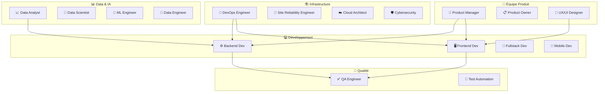
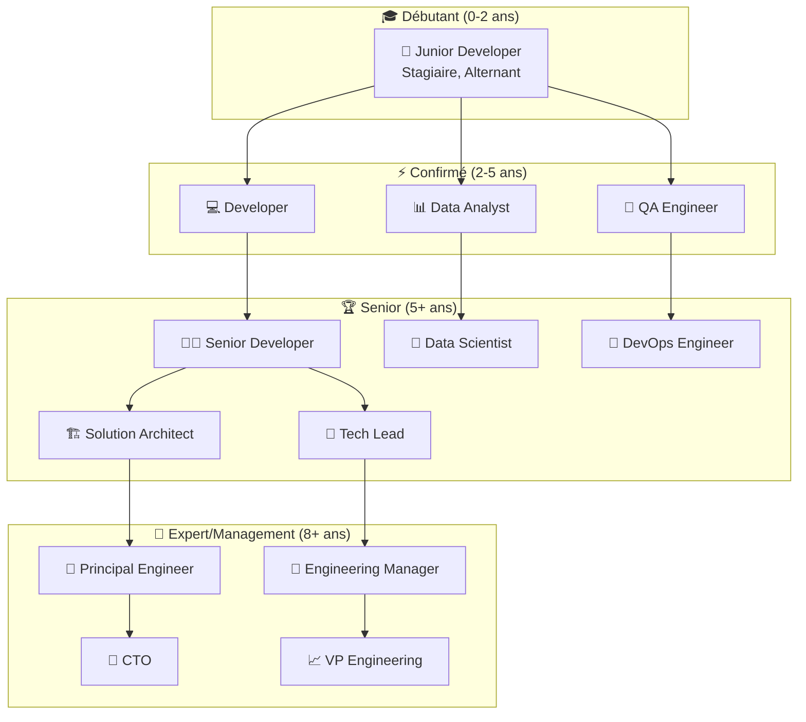

# Les métiers de l'informatique

## Guide d'orientation - Découvrir les rôles tech

Bienvenue dans l'univers des métiers de l'informatique ! Ce guide te présente les différents rôles qu'on retrouve aujourd'hui dans une entreprise tech, des développeurs aux experts en cybersécurité, en passant par les spécialistes de la data.

---

## 🌍 Vue d'ensemble : L'écosystème tech

---

## 💻 Développement - Créer les applications

### 🖥️ Développeur Frontend

**Mission :** Créer tout ce que l'utilisateur voit et avec quoi il interagit

**Technologies principales :**

- **Langages :** JavaScript, TypeScript, HTML, CSS
- **Frameworks :** React, Vue.js, Angular, Svelte
- **Outils :** Webpack, Vite, Tailwind CSS, Figma

**Au quotidien :**

- Transformer les maquettes en interfaces fonctionnelles
- Optimiser l'expérience utilisateur
- S'assurer que le site marche sur tous les navigateurs
- Collaborer étroitement avec les designers

### ⚙️ Développeur Backend

**Mission :** Développer la logique métier et les APIs

**Technologies principales :**

- **Langages :** Python, Java, C#, Go, Node.js, PHP
- **Frameworks :** Django/FastAPI, Spring Boot, .NET, Gin, Express
- **Bases de données :** PostgreSQL, MySQL, MongoDB, Redis

**Au quotidien :**

- Créer des APIs pour le frontend
- Gérer les bases de données
- Optimiser les performances
- Implémenter la sécurité et l'authentification

### 🔄 Développeur Fullstack

**Mission :** Maîtriser à la fois le frontend et le backend

**Technologies principales :**

- **Stacks populaires :** MEAN (MongoDB/Express/Angular/Node), LAMP (Linux/Apache/MySQL/PHP), Django + React
- **Frameworks fullstack :** Next.js, Nuxt.js, SvelteKit

**Au quotidien :**

- Développer des fonctionnalités de A à Z
- Faire le lien entre frontend et backend
- Avoir une vision globale du projet

### 📱 Développeur Mobile

**Mission :** Créer des applications mobiles

**Technologies principales :**

- **iOS :** Swift, Objective-C, Xcode
- **Android :** Kotlin, Java, Android Studio
- **Cross-platform :** React Native, Flutter, Xamarin

**Au quotidien :**

- Adapter l'UX aux contraintes mobile
- Gérer les notifications push
- Optimiser pour la batterie et les performances
- Publier sur les stores (App Store, Google Play)

---

## 🏗️ Infrastructure & DevOps - Faire tourner les applications

### 🔧 DevOps Engineer

**Mission :** Automatiser et améliorer les processus de développement et déploiement

**Technologies principales :**

- **Cloud :** AWS, Azure, Google Cloud Platform
- **Containers :** Docker, Kubernetes, Docker Compose
- **CI/CD :** Jenkins, GitHub Actions, GitLab CI, CircleCI
- **Infrastructure as Code :** Terraform, Ansible, CloudFormation

**Au quotidien :**

- Automatiser les déploiements
- Gérer l'infrastructure cloud
- Optimiser les coûts et performances
- Créer des pipelines CI/CD

### 🚨 Site Reliability Engineer (SRE)

**Mission :** S'assurer que les applications sont toujours disponibles et performantes

**Technologies principales :**

- **Monitoring :** Prometheus, Grafana, DataDog, New Relic
- **Logging :** ELK Stack (Elasticsearch, Logstash, Kibana)
- **Alerting :** PagerDuty, OpsGenie
- **Scripting :** Python, Bash, Go

**Au quotidien :**

- Surveiller la santé des applications
- Répondre aux incidents de production
- Analyser les causes racines des pannes
- Définir des SLOs (Service Level Objectives)

### ☁️ Cloud Architect

**Mission :** Concevoir l'architecture technique dans le cloud

**Technologies principales :**

- **Plateformes :** AWS, Azure, Google Cloud
- **Services :** Lambda, S3, RDS, API Gateway, CDN
- **Sécurité :** IAM, VPC, Security Groups
- **Architecture :** Microservices, Serverless, Event-driven

**Au quotidien :**

- Définir l'architecture technique globale
- Choisir les services cloud appropriés
- Optimiser les coûts et la scalabilité
- Assurer la sécurité et la conformité

---

## 🛡️ Cybersécurité - Protéger les données et systèmes

### 🔒 Cybersecurity Engineer

**Mission :** Protéger l'entreprise contre les cyberattaques

**Technologies principales :**

- **Outils de sécurité :** Nessus, Metasploit, Wireshark, Burp Suite
- **SIEM :** Splunk, QRadar, Sentinel
- **Frameworks :** OWASP, NIST, ISO 27001
- **Langages :** Python, PowerShell, Bash

**Au quotidien :**

- Effectuer des tests de pénétration
- Analyser les vulnérabilités
- Répondre aux incidents de sécurité
- Former les équipes aux bonnes pratiques

### 🕵️ Security Analyst

**Mission :** Surveiller et analyser les menaces de sécurité

**Technologies principales :**

- **SOC Tools :** SIEM, SOAR, EDR
- **Threat Intelligence :** MISP, OpenCTI
- **Forensics :** Volatility, Autopsy, FTK

**Au quotidien :**

- Monitorer les alertes de sécurité
- Investiguer les incidents
- Analyser les malwares
- Créer des rapports de sécurité

---

## 📊 Data & Intelligence Artificielle - Exploiter les données

### 📈 Data Analyst

**Mission :** Analyser les données pour aider à la prise de décision

**Technologies principales :**

- **Langages :** SQL, Python, R
- **Outils BI :** Tableau, Power BI, Looker, Metabase
- **Databases :** PostgreSQL, BigQuery, Snowflake
- **Python libs :** Pandas, NumPy, Matplotlib, Seaborn

**Au quotidien :**

- Créer des dashboards et rapports
- Analyser les tendances business
- Nettoyer et préparer les données
- Présenter les insights aux équipes métier

### 🔬 Data Scientist

**Mission :** Utiliser les statistiques et le machine learning pour résoudre des problèmes business

**Technologies principales :**

- **Langages :** Python, R, SQL
- **ML Libraries :** Scikit-learn, TensorFlow, PyTorch, Keras
- **Notebooks :** Jupyter, Google Colab
- **MLOps :** MLflow, Kubeflow, Weights & Biases

**Au quotidien :**

- Construire des modèles prédictifs
- Expérimenter avec différents algorithmes
- Analyser les résultats et leur impact business
- Collaborer avec les équipes produit

### 🤖 Machine Learning Engineer

**Mission :** Mettre en production les modèles de machine learning

**Technologies principales :**

- **MLOps :** Docker, Kubernetes, MLflow, Airflow
- **Cloud ML :** AWS SageMaker, Azure ML, Google AI Platform
- **APIs :** FastAPI, Flask, TensorFlow Serving
- **Monitoring :** Prometheus, Grafana pour les modèles ML

**Au quotidien :**

- Déployer les modèles en production
- Automatiser les pipelines de ML
- Monitorer les performances des modèles
- Optimiser les modèles pour la production

### 🔧 Data Engineer

**Mission :** Construire et maintenir l'infrastructure de données

**Technologies principales :**

- **Big Data :** Apache Spark, Hadoop, Kafka
- **Orchestration :** Airflow, Prefect, Dagster
- **Cloud :** AWS (S3, Redshift), GCP (BigQuery), Azure (Synapse)
- **Databases :** PostgreSQL, MongoDB, Cassandra, ClickHouse

**Au quotidien :**

- Construire des pipelines de données (ETL)
- Gérer les data warehouses
- Assurer la qualité des données
- Optimiser les performances des requêtes

---

## 🎨 Design & Expérience Utilisateur

### 🎨 UX/UI Designer

**Mission :** Concevoir des interfaces utilisateur intuitives et esthétiques

**Outils principaux :**

- **Design :** Figma, Sketch, Adobe XD
- **Prototyping :** InVision, Principle, Framer
- **User Research :** Hotjar, UsabilityHub, Maze
- **Collaboration :** Miro, FigJam

**Au quotidien :**

- Créer des wireframes et maquettes
- Conduire des recherches utilisateur
- Tester l'utilisabilité des interfaces
- Collaborer avec les développeurs frontend

---

## 🎯 Gestion de Projet & Produit

### 🎯 Product Manager

**Mission :** Définir la vision et la stratégie produit

**Outils principaux :**

- **Roadmap :** ProductPlan, Aha!, Roadmunk
- **Analytics :** Google Analytics, Mixpanel, Amplitude
- **User Feedback :** Intercom, Zendesk, UserVoice
- **Collaboration :** Slack, Notion, Confluence

**Au quotidien :**

- Définir les fonctionnalités à développer
- Analyser les métriques produit
- Recueillir les retours utilisateurs
- Prioriser le backlog avec les équipes

### 📋 Product Owner

**Mission :** Faire le lien entre l'équipe technique et les besoins métier

**Outils principaux :**

- **Agile :** Jira, Azure DevOps, Trello
- **Documentation :** Confluence, Notion
- **Communication :** Slack, Microsoft Teams

**Au quotidien :**

- Rédiger les user stories
- Prioriser le backlog avec l'équipe dev
- Valider les fonctionnalités développées
- Animer les cérémonies Scrum

### 🚀 Tech Lead / Lead Developer

**Mission :** Encadrer techniquement une équipe de développeurs

**Technologies :**

- **Expertise technique** dans une ou plusieurs stacks
- **Architecture :** Microservices, Design Patterns
- **Management :** Coaching, Code Review
- **Outils de collaboration :** Git, GitHub/GitLab

**Au quotidien :**

- Faire des choix d'architecture
- Encadrer et former les développeurs juniors
- Faire des code reviews
- Interfacer avec les Product Managers

---

## 🧪 Qualité & Tests

### ✅ QA Engineer (Quality Assurance)

**Mission :** S'assurer de la qualité du logiciel avant sa mise en production

**Outils principaux :**

- **Test Management :** TestRail, Zephyr, qTest
- **Bug Tracking :** Jira, Bugzilla, Mantis
- **API Testing :** Postman, Insomnia, SoapUI
- **Performance :** JMeter, LoadRunner

**Au quotidien :**

- Créer des plans de test
- Exécuter des tests manuels
- Reporter et suivre les bugs
- Valider les corrections

### 🧪 Test Automation Engineer

**Mission :** Automatiser les tests pour accélérer les cycles de développement

**Technologies principales :**

- **Web :** Selenium, Playwright, Cypress
- **Mobile :** Appium, Espresso, XCUITest
- **API :** REST Assured, Postman/Newman
- **Frameworks :** TestNG, JUnit, Pytest

**Au quotidien :**

- Développer des scripts de tests automatisés
- Maintenir les suites de tests
- Intégrer les tests dans les pipelines CI/CD
- Analyser les résultats de tests

---

## 💼 Évolution de carrière et spécialisations

---

## 💰 Fourchettes de salaires (France, 2025)

| Rôle                      | Junior (0-2 ans) | Confirmé (2-5 ans) | Senior (5+ ans) |
| ------------------------- | ---------------- | ------------------ | --------------- |
| **Développeur Frontend**  | 35-45k€          | 45-60k€            | 60-80k€         |
| **Développeur Backend**   | 38-48k€          | 48-65k€            | 65-85k€         |
| **Développeur Fullstack** | 36-46k€          | 46-62k€            | 62-80k€         |
| **DevOps Engineer**       | 40-50k€          | 50-70k€            | 70-95k€         |
| **Data Scientist**        | 42-52k€          | 52-70k€            | 70-90k€         |
| **Cybersecurity**         | 40-50k€          | 50-75k€            | 75-100k€        |
| **Product Manager**       | 45-55k€          | 55-75k€            | 75-100k€        |
| **Tech Lead**             | -                | 60-75k€            | 75-100k€        |

_💡 Les salaires varient énormément selon la région, la taille de l'entreprise et les compétences spécifiques_

---

## 🎯 Comment choisir ton orientation ?

### ❓ Quelques questions pour t'aider

**Tu aimes créer des interfaces ?** → Frontend Developer, UX/UI Designer  
**Tu préfères la logique et les algorithmes ?** → Backend Developer, Data Scientist  
**Tu veux tout comprendre ?** → Fullstack Developer, DevOps Engineer  
**Tu es passionné de sécurité ?** → Cybersecurity Engineer  
**Tu aimes les données et statistiques ?** → Data Analyst, Data Scientist  
**Tu préfères organiser et coordonner ?** → Product Manager, Scrum Master

### 🚀 Par où commencer ?

1. **🧪 Expérimente** : Teste différents langages et technologies
2. **🎓 Forme-toi** : École d'ingé, BTS, autodidacte, bootcamps
3. **💼 Stage/Alternance** : Découvre la réalité du terrain
4. **🌐 Projets perso** : Crée ton portfolio
5. **🤝 Réseaute** : Meetups, conférences, communautés en ligne

---

## 🌟 L'avenir des métiers tech

### 📈 Tendances 2025-2030

- **🤖 IA partout** : Tous les métiers vont intégrer l'IA
- **🛡️ Cybersécurité** : Demande croissante avec la digitalisation
- **☁️ Cloud-first** : Expertise cloud indispensable
- **📊 Data-driven** : Décisions basées sur les données
- **🌱 Green IT** : Développement durable et éco-responsable
- **🔄 Low-code/No-code** : Outils visuels pour créer des apps

### 🔮 Nouveaux métiers émergents

- **🤖 AI/ML Engineer** : Spécialiste de l'IA en production
- **🛡️ DevSecOps** : Sécurité intégrée dans DevOps
- **🌱 Green Software Engineer** : Développement éco-responsable
- **🔍 AI Ethics Specialist** : Éthique de l'intelligence artificielle
- **🎮 Metaverse Developer** : Développement pour la réalité virtuelle

---

## 🎉 Conclusion

Le monde de l'informatique offre une incroyable diversité de métiers ! Que tu sois plutôt :

- **Créatif** (Frontend, UX/UI)
- **Logique** (Backend, Data)
- **Organisé** (DevOps, Product)
- **Curieux** (Cybersécurité, R&D)

Il y a forcément un métier fait pour toi ! L'important est de rester curieux, de continuer à apprendre et de ne pas avoir peur d'essayer différentes voies.

**Remember** : La tech évolue vite, les métiers aussi. Ce qui compte, c'est ta capacité d'adaptation et ta passion pour résoudre des problèmes ! 🚀
