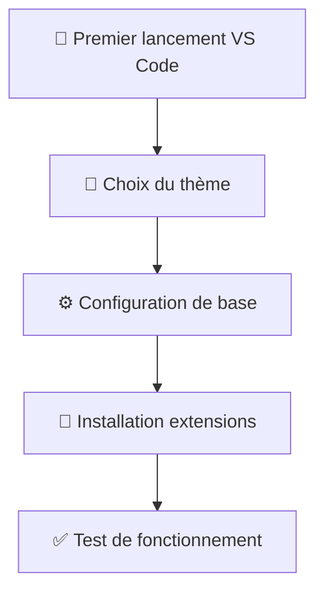

# Setup environnement de développement

## VS Code + Docker sur Windows 11

Bienvenue dans le monde du développement ! Ce guide va t'accompagner pour installer et configurer un environnement de développement professionnel sur ton PC Windows 11. Tu vas installer Visual Studio Code (l'éditeur de code le plus populaire) et Docker (pour créer des environnements isolés).

---

## 🎯 Pourquoi ces outils ?

### 📝 Visual Studio Code

- **Gratuit** et développé par Microsoft
- **Extensible** avec des milliers d'extensions
- **Universel** : supporte tous les langages de programmation
- **Intégration Git** native
- **Terminal intégré** pour exécuter des commandes

### 🐳 Docker

- **Environnements reproductibles** : "ça marche sur ma machine" devient "ça marche partout"
- **Isolation** : chaque projet dans son propre container
- **Simplicité** : plus besoin d'installer 10 versions différentes de Python/Node
- **Professionnel** : utilisé par toutes les entreprises tech

---

## 📋 Pré-requis

Avant de commencer, vérifie que tu as :

- ✅ Windows 11 à jour
- ✅ Droits administrateur sur ton PC
- ✅ Au moins 8 GB de RAM (recommandé : 16 GB)
- ✅ 20 GB d'espace disque libre
- ✅ Connexion Internet stable

---

## 🚀 Étape 1 : Installation de Visual Studio Code

### 📥 Téléchargement

1. **Ouvre ton navigateur** et va sur : https://code.visualstudio.com/
2. **Clique sur "Download for Windows"** - le site détecte automatiquement ton OS
3. **Télécharge le fichier** `VSCodeUserSetup-x64-1.x.x.exe`

### 🔧 Installation

1. **Lance l'installateur** en double-cliquant sur le fichier téléchargé
2. **Accepte la licence** et clique sur "Suivant"
3. **Choisis le dossier d'installation** (laisse par défaut : `C:\Users\{nom}\AppData\Local\Programs\Microsoft VS Code`)
4. **Options importantes à cocher :**
   - ✅ "Ajouter à PATH" (très important !)
   - ✅ "Créer une icône sur le bureau"
   - ✅ "Ajouter l'action 'Ouvrir avec Code' au menu contextuel des fichiers"
   - ✅ "Ajouter l'action 'Ouvrir avec Code' au menu contextuel des dossiers"
5. **Clique sur "Installer"** et patiente quelques minutes
6. **Lance VS Code** à la fin de l'installation

### 🎨 Premier lancement et configuration



**Configuration initiale :**

1. **Choix du thème :** Dark+ (par défaut) est très bien pour commencer
2. **Ouvre les paramètres :** `Ctrl + ,` ou `File > Preferences > Settings`
3. **Configure ces paramètres essentiels :**

```json
{
  "editor.fontSize": 14,
  "editor.tabSize": 2,
  "editor.insertSpaces": true,
  "editor.wordWrap": "on",
  "editor.minimap.enabled": true,
  "editor.formatOnSave": true,
  "files.autoSave": "afterDelay",
  "files.autoSaveDelay": 1000,
  "terminal.integrated.defaultProfile.windows": "PowerShell"
}
```

### 🧩 Extensions essentielles à installer

**Pour installer une extension :**

1. Clique sur l'icône Extensions dans la barre latérale (ou `Ctrl + Shift + X`)
2. Tape le nom de l'extension dans la barre de recherche
3. Clique sur "Install"

**Extensions indispensables :**

| Extension                  | Description                              | Pourquoi l'installer                  |
| -------------------------- | ---------------------------------------- | ------------------------------------- |
| **GitLens**                | Améliore l'intégration Git               | Voir l'historique du code facilement  |
| **Prettier**               | Formatage automatique du code            | Code toujours bien formaté            |
| **Auto Rename Tag**        | Renomme les balises HTML automatiquement | Évite les erreurs HTML                |
| **Bracket Pair Colorizer** | Colore les parenthèses par paires        | Plus facile de s'y retrouver          |
| **Live Share**             | Collaboration en temps réel              | Partager ton écran avec d'autres devs |
| **Thunder Client**         | Client REST pour tester les APIs         | Tester tes APIs sans quitter VS Code  |
| **Docker**                 | Support pour Docker                      | Gérer tes containers directement      |
| **Remote - Containers**    | Développer dans des containers           | Environnements de dev isolés          |

---

## 🐳 Étape 2 : Installation de Docker Desktop

### 📥 Téléchargement

1. **Va sur :** https://www.docker.com/products/docker-desktop/
2. **Clique sur "Download for Windows"**
3. **Télécharge** `Docker Desktop Installer.exe`

### ⚙️ Pré-requis Windows : WSL 2

Docker sur Windows utilise WSL 2 (Windows Subsystem for Linux). On doit l'activer :

#### Activation de WSL 2

1. **Ouvre PowerShell en tant qu'administrateur :**

   - Clique droit sur le menu Démarrer
   - Sélectionne "Terminal (Admin)" ou "PowerShell (Admin)"

2. **Exécute ces commandes une par une :**

```powershell
# Active la fonctionnalité WSL
dism.exe /online /enable-feature /featurename:Microsoft-Windows-Subsystem-Linux /all /norestart

# Active la fonctionnalité Virtual Machine Platform
dism.exe /online /enable-feature /featurename:VirtualMachinePlatform /all /norestart

# Redémarre ton PC
Restart-Computer
```

3. **Après le redémarrage, rouvre PowerShell Admin et exécute :**

```powershell
# Définit WSL 2 comme version par défaut
wsl --set-default-version 2

# Installe Ubuntu (optionnel mais recommandé)
wsl --install -d Ubuntu
```

### 🔧 Installation de Docker Desktop

1. **Lance l'installateur** `Docker Desktop Installer.exe`
2. **Configuration recommandée :**
   - ✅ "Use WSL 2 instead of Hyper-V" (coché par défaut)
   - ✅ "Add shortcut to desktop"
3. **Clique sur "Ok"** et patiente (installation longue : 5-10 minutes)
4. **Redémarre ton PC** quand demandé

### 🚀 Premier lancement de Docker

1. **Lance Docker Desktop** depuis le bureau ou le menu Démarrer
2. **Accepte les termes** de service
3. **Connexion optionnelle :** Tu peux créer un compte Docker (gratuit) ou "Skip" pour l'instant
4. **Vérifie que Docker fonctionne :**

```bash
# Ouvre un terminal (PowerShell ou invite de commande)
# Tape cette commande pour vérifier que Docker est installé
docker --version

# Résultat attendu : Docker version 24.x.x
```

5. **Test avec ton premier container :**

```bash
# Lance un container de test
docker run hello-world

# Si tu vois "Hello from Docker!" c'est que ça marche ! 🎉
```

---

## 🔗 Étape 3 : Intégration VS Code + Docker

### 🔌 Configuration de l'extension Docker

1. **Dans VS Code, va dans Extensions** (`Ctrl + Shift + X`)
2. **Cherche "Docker"** et installe l'extension officielle de Microsoft
3. **Redémarre VS Code** après installation

### 🧪 Test de l'intégration

**Création d'un projet de test :**

1. **Crée un nouveau dossier** sur ton Bureau : `test-docker`
2. **Ouvre ce dossier dans VS Code :** `File > Open Folder`
3. **Crée un fichier** `Dockerfile` (sans extension) avec ce contenu :

```dockerfile
# Dockerfile de test simple
FROM nginx:alpine

# Copie une page HTML simple
COPY index.html /usr/share/nginx/html/

# Expose le port 80
EXPOSE 80
```

4. **Crée un fichier** `index.html` :

```html
<!DOCTYPE html>
<html>
  <head>
    <title>Mon premier projet Docker !</title>
    <style>
      body {
        font-family: Arial, sans-serif;
        text-align: center;
        background: linear-gradient(45deg, #667eea 0%, #764ba2 100%);
        color: white;
        padding: 50px;
      }
      h1 {
        font-size: 3em;
      }
      p {
        font-size: 1.2em;
      }
    </style>
  </head>
  <body>
    <h1>🎉 Félicitations !</h1>
    <p>Ton environnement Docker + VS Code fonctionne parfaitement !</p>
    <p>Tu es prêt à développer comme un pro ! 🚀</p>
  </body>
</html>
```

5. **Dans le terminal VS Code** (`Ctrl + ù`), exécute :

```bash
# Build ton premier container
docker build -t mon-premier-site .

# Lance le container
docker run -d -p 8080:80 mon-premier-site

# Ouvre ton navigateur sur http://localhost:8080
```

**Si tu vois ta page web, bravo ! Tout fonctionne ! 🎉**

---

## ⚡ Étape 4 : Configuration avancée et optimisations

### 🚀 Performance de Docker sur Windows

**Optimisation des ressources :**

1. **Ouvre Docker Desktop**
2. **Va dans Settings** (icône engrenage)
3. **Section "Resources" :**
   - **Memory :** 4-6 GB (selon ta RAM totale)
   - **CPUs :** 2-4 (selon ton processeur)
   - **Disk image size :** 64 GB minimum

### 🔧 Configuration VS Code pour Docker

**Crée un fichier de configuration workspace :**

1. **Dans VS Code, crée** `.vscode/settings.json` :

```json
{
  "docker.showStartPage": false,
  "docker.containers.groupBy": "Compose Project Name",
  "docker.containers.sortBy": "CreatedTime",
  "docker.images.sortBy": "CreatedTime",
  "terminal.integrated.defaultProfile.windows": "PowerShell"
}
```

### 🐳 Commandes Docker essentielles à retenir

```bash
# Gestion des containers
docker ps                    # Liste les containers en cours
docker ps -a                 # Liste tous les containers
docker stop <container_id>   # Arrête un container
docker rm <container_id>     # Supprime un container

# Gestion des images
docker images               # Liste les images
docker rmi <image_id>       # Supprime une image
docker pull <image_name>    # Télécharge une image

# Nettoyage
docker system prune         # Nettoie tout ce qui n'est pas utilisé
docker system prune -a      # Nettoyage complet (attention !)
```

---

## 🛠️ Étape 5 : Outils et extensions supplémentaires

### 🌟 Extensions VS Code par domaine

**Pour le développement web :**

- **Live Server** : Serveur local avec rechargement automatique
- **HTML CSS Support** : Autocomplétion CSS dans HTML
- **ES7+ React/Redux/React-Native snippets** : Snippets pour React

**Pour l'organisation :**

- **Todo Tree** : Gestion des TODO dans le code
- **Project Manager** : Basculer rapidement entre projets
- **Bookmarks** : Marquer des lignes importantes

### 🔧 Outils en ligne de commande utiles

**Installation via PowerShell (optionnel) :**

```powershell
# Installer Chocolatey (gestionnaire de paquets Windows)
Set-ExecutionPolicy Bypass -Scope Process -Force
[System.Net.ServicePointManager]::SecurityProtocol = [System.Net.ServicePointManager]::SecurityProtocol -bor 3072
iex ((New-Object System.Net.WebClient).DownloadString('https://chocolatey.org/install.ps1'))

# Installer Git (si pas déjà fait)
choco install git -y

# Installer Node.js (pour JavaScript)
choco install nodejs -y

# Installer Python (pour Python)
choco install python -y
```

---

## ✅ Étape 6 : Vérification finale

### 🧪 Checklist de vérification

**VS Code :**

- [ ] VS Code s'ouvre sans erreur
- [ ] Terminal intégré fonctionne (`Ctrl + ù`)
- [ ] Extensions Docker installées
- [ ] Peut ouvrir des dossiers et créer des fichiers
- [ ] Syntaxe colorée fonctionne

**Docker :**

- [ ] `docker --version` retourne une version
- [ ] `docker run hello-world` fonctionne
- [ ] Docker Desktop démarre automatiquement
- [ ] Peut construire et lancer des containers

**Intégration :**

- [ ] Extension Docker visible dans VS Code
- [ ] Peut voir les containers dans l'onglet Docker
- [ ] Terminal peut exécuter des commandes Docker

### 🎯 Test final complet

**Crée un projet complet de test :**

1. **Nouveau dossier :** `test-environnement`
2. **Fichier `docker-compose.yml` :**

```yaml
version: "3.8"
services:
  web:
    build: .
    ports:
      - "3000:80"
    volumes:
      - ./html:/usr/share/nginx/html
```

3. **Dossier `html/` avec `index.html` :**

```html
<!DOCTYPE html>
<html>
  <head>
    <title>Test Environnement ✅</title>
    <style>
      body {
        font-family: "Segoe UI", Tahoma, Geneva, Verdana, sans-serif;
        background: #1e1e1e;
        color: #fff;
        text-align: center;
        padding: 50px;
      }
      .container {
        max-width: 800px;
        margin: 0 auto;
        background: #252526;
        border-radius: 10px;
        padding: 40px;
        box-shadow: 0 4px 20px rgba(0, 0, 0, 0.3);
      }
      h1 {
        color: #4caf50;
        font-size: 2.5em;
        margin-bottom: 20px;
      }
      .check {
        color: #4caf50;
        font-size: 1.5em;
      }
      .tools {
        display: flex;
        justify-content: space-around;
        margin-top: 30px;
      }
      .tool {
        background: #333;
        padding: 20px;
        border-radius: 8px;
      }
    </style>
  </head>
  <body>
    <div class="container">
      <h1>🎉 Environnement de développement configuré !</h1>

      <div class="check">✅ VS Code installé et configuré</div>
      <div class="check">✅ Docker fonctionnel</div>
      <div class="check">✅ Extensions installées</div>
      <div class="check">✅ Test d'intégration réussi</div>

      <div class="tools">
        <div class="tool">
          <h3>🛠️ VS Code</h3>
          <p>Éditeur de code professionnel</p>
        </div>
        <div class="tool">
          <h3>🐳 Docker</h3>
          <p>Containers et environnements</p>
        </div>
        <div class="tool">
          <h3>🚀 Prêt à coder !</h3>
          <p>Python, JavaScript, et plus...</p>
        </div>
      </div>
    </div>
  </body>
</html>
```

4. **Lance avec :** `docker-compose up --build`
5. **Visite :** http://localhost:3000

**Si tu vois la page, tu es officiellement prêt à développer ! 🚀**

---

## 🎯 Prochaines étapes

Maintenant que ton environnement est configuré, tu es prêt pour :

1. **🐍 Python** : Data science, backend, automation
2. **🌐 JavaScript** : Frontend, backend (Node.js), applications web
3. **🗄️ Bases de données** : PostgreSQL, MongoDB dans Docker
4. **🔄 Git** : Versionning et collaboration
5. **☁️ Cloud** : AWS, Azure, déploiement

### 🔖 Ressources utiles à bookmarker

- **Documentation Docker :** https://docs.docker.com/
- **VS Code Tips :** https://code.visualstudio.com/docs
- **Docker Hub :** https://hub.docker.com/ (images pré-construites)
- **Git Tutorial :** https://learngitbranching.js.org/

### 🆘 En cas de problème

**Problèmes courants et solutions :**

| Problème                  | Solution                                    |
| ------------------------- | ------------------------------------------- |
| Docker ne démarre pas     | Vérifier que WSL 2 est activé et à jour     |
| "Permission denied"       | Lancer PowerShell en administrateur         |
| Container ne se lance pas | Vérifier que le port n'est pas déjà utilisé |
| VS Code lent              | Désactiver les extensions non utilisées     |
| Git non reconnu           | Redémarrer VS Code après installation Git   |

---

## 🎉 Félicitations !

Tu as maintenant un environnement de développement professionnel ! Tu rejoins les millions de développeurs qui utilisent VS Code et Docker quotidiennement. Bienvenue dans la communauté tech ! 🚀

**Tu es prêt à :**

- Développer dans n'importe quel langage
- Créer des applications dans des environnements isolés
- Collaborer avec d'autres développeurs
- Déployer tes applications facilement

**Next step :** Choisir ton premier langage de programmation et créer ton premier vrai projet ! 💻
