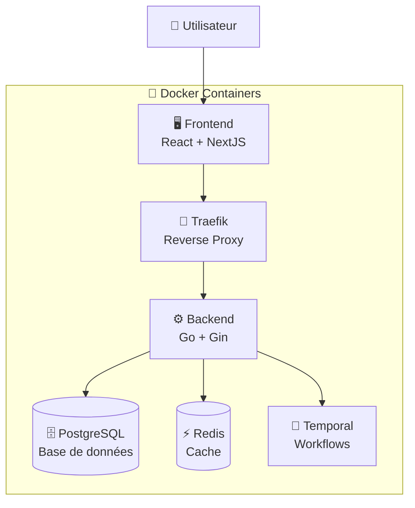
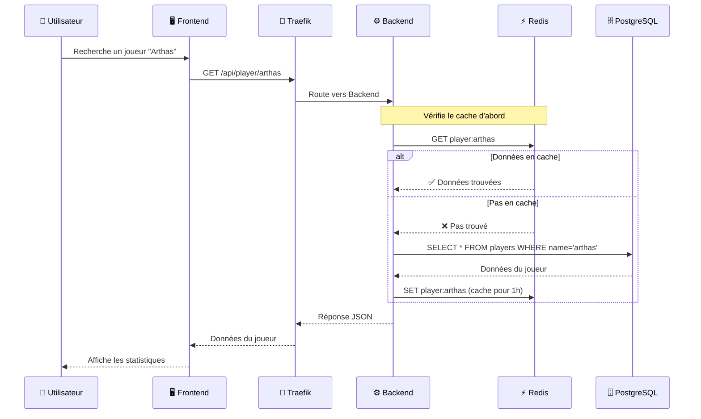
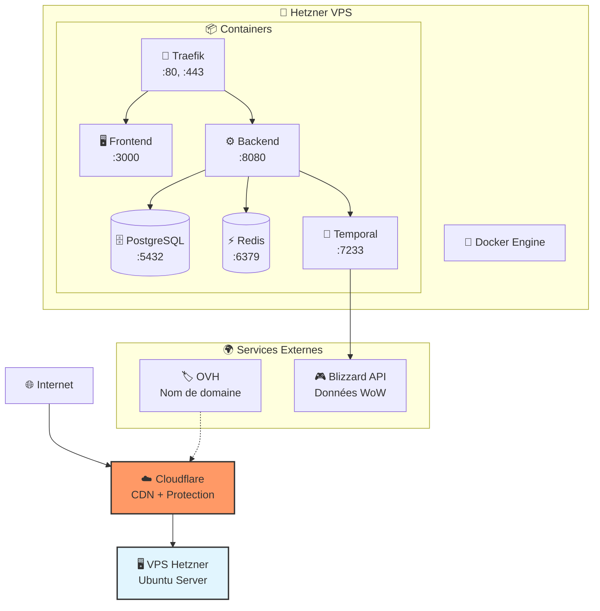

# Introduction à WoW Perf

## Comprendre une application web moderne

Bienvenue dans le monde du développement web ! Aujourd'hui, nous allons explorer ensemble comment fonctionne WoW Perf, une application web complète, et découvrir tous les éléments qui permettent de créer et faire fonctionner une application moderne sur Internet.

---

## 🎯 Qu'est-ce que WoW Perf ?

WoW Perf est une application qui analyse les performances des joueurs dans World of Warcraft. Comme toute application web moderne, elle est constituée de plusieurs parties qui travaillent ensemble pour offrir une expérience utilisateur fluide et performante.

---

## 🏗️ Architecture générale : Le Frontend et le Backend

### Frontend (La partie visible)

**Technologies utilisées : React, NextJS, TailwindCSS, ShadcnUI**

Le **frontend** est tout ce que l'utilisateur voit et avec quoi il interagit dans son navigateur :

- Les pages web
- Les boutons, formulaires, menus
- Les animations et l'interface graphique

**Pourquoi ces technologies ?**

- **React** : Framework JavaScript qui permet de créer des interfaces interactives et réactives
- **NextJS** : Surcouche de React qui ajoute des fonctionnalités comme le rendu côté serveur et l'optimisation
- **TailwindCSS** : Framework CSS qui permet de styliser rapidement et de manière cohérente
- **ShadcnUI** : Bibliothèque de composants pré-construits pour aller plus vite

### Backend (Le cerveau invisible)

**Technologies utilisées : Go, Gin, PostgreSQL, Redis, Temporal**

Le **backend** est la partie invisible qui traite les demandes, gère les données et la logique métier :

- Récupère et traite les données
- Communique avec les APIs externes (Blizzard pour WoW)
- Gère l'authentification et la sécurité
- Stocke et organise les informations

**Pourquoi ces technologies ?**

- **Go** : Langage de programmation rapide et efficace, parfait pour les serveurs
- **Gin** : Framework web pour Go qui simplifie la création d'APIs
- **PostgreSQL** : Base de données relationnelle robuste pour stocker les données de manière structurée
- **Redis** : Système de cache ultra-rapide pour accélérer les réponses
- **Temporal** : Orchestrateur de workflows pour gérer les tâches complexes et répétitives

---

## 🔄 Communication Frontend ↔ Backend

### Comment ils communiquent ?

**Technologies utilisées : Axios, React Query**

- **Axios** : Bibliothèque qui permet au frontend d'envoyer des requêtes HTTP au backend
- **React Query** : Gestionnaire intelligent des données qui optimise les appels vers le backend

**Exemple concret :**

1. L'utilisateur recherche un joueur
2. Le frontend envoie une requête au backend via Axios
3. Le backend interroge la base de données
4. Le backend renvoie les résultats au frontend
5. React Query met à jour l'interface automatiquement

---

## 🐳 Conteneurisation : Docker et Docker Compose

### Pourquoi Docker ?

Imagine que ton application soit une recette de cuisine. Docker est comme un emballage qui contient :

- Tous les ingrédients (ton code)
- Tous les ustensiles (les dépendances)
- La recette exacte (la configuration)

**Avantages :**

- L'application fonctionne partout de la même manière
- Facile à déployer et à mettre à jour
- Isolation des composants

### Docker Compose

C'est l'orchestrateur qui fait fonctionner tous les containers ensemble :

- Un container pour le frontend
- Un container pour le backend
- Un container pour PostgreSQL
- Un container pour Redis
- Un container pour Traefik

---

## 🌐 Infrastructure et Déploiement

### Reverse Proxy : Traefik

**Le chef d'orchestre des requêtes**

Traefik agit comme un réceptionniste intelligent :

- Il reçoit toutes les requêtes qui arrivent sur ton serveur
- Il décide où les rediriger (frontend, backend, API)
- Il gère automatiquement les certificats HTTPS
- Il équilibre la charge si nécessaire

**Exemple :**

- `wowperf.com` → Frontend React
- `api.wowperf.com` → Backend Go
- Tout est automatiquement sécurisé en HTTPS

### Hébergement et Infrastructure

#### VPS Hetzner (Le serveur physique)

- Serveur Ubuntu dans un datacenter en Allemagne
- Puissant, fiable et économique
- C'est là que tournent tous tes containers Docker

#### Nom de domaine OVH

- `wowperf.com` acheté chez OVH
- C'est ton "adresse" sur Internet

#### Cloudflare (Le bouclier protecteur)

- Accélère ton site dans le monde entier (CDN)
- Protège contre les attaques DDoS
- Gère les sous-domaines (`api.wowperf.com`, `admin.wowperf.com`)
- Optimise automatiquement les performances

---

## 🔄 Workflow de données avec Temporal

### Le problème

Récupérer et analyser les données de WoW est complexe :

- Millions de joueurs à analyser
- APIs externes avec des limites
- Traitements longs et gourmands
- Risque de pannes ou d'interruptions

### La solution : Temporal

Temporal orchestre des **workflows** (séquences de tâches) :

1. Récupérer la liste des joueurs d'une guilde
2. Pour chaque joueur, récupérer ses statistiques
3. Analyser les performances
4. Mettre à jour la base de données
5. Notifier les utilisateurs

**Avantages :**

- Reprend automatiquement en cas d'erreur
- Gère les timeouts et les retry
- Permet de suivre l'avancement en temps réel

---

## 🚀 Le cycle de développement à production

### 1. Développement local

- Code sur ton ordinateur
- Teste avec Docker Compose
- Toutes les données en local

### 2. Déploiement

- Code poussé sur Git
- Containers buildés automatiquement
- Déployés sur le VPS Hetzner

### 3. Production

- Accessible depuis Internet
- Haute disponibilité
- Monitoring et logs pour surveiller

---

## 🎯 Pourquoi cette architecture ?

### Performance

- **Redis** : Cache ultra-rapide
- **Go** : Backend très performant
- **Cloudflare** : CDN mondial
- **NextJS** : Optimisations automatiques

### Scalabilité

- **Docker** : Facile d'ajouter des instances
- **Microservices** : Chaque partie peut évoluer indépendamment
- **Temporal** : Gère de gros volumes de données

### Fiabilité

- **PostgreSQL** : Base de données robuste
- **Temporal** : Workflows résistants aux pannes
- **Cloudflare** : Protection et disponibilité

### Facilité de développement

- **React** : Interface moderne et réactive
- **Docker** : Environnement reproductible
- **Traefik** : Configuration automatique

---

## 🔍 Questions pour approfondir

1. **Frontend** : Comment React rend-il l'interface interactive ?
2. **Backend** : Pourquoi utiliser un cache comme Redis ?
3. **Infrastructure** : Que se passe-t-il quand un utilisateur tape `wowperf.com` ?
4. **Données** : Comment Temporal gère-t-il des millions de requêtes vers l'API Blizzard ?
5. **Sécurité** : Comment Cloudflare protège-t-il l'application ?

---

## 🎉 Prochaines étapes

Maintenant que tu as une vue d'ensemble, nous allons explorer chaque partie plus en détail :

- Regarder le code du frontend et du backend
- Voir comment les containers communiquent
- Observer les workflows Temporal en action
- Comprendre le monitoring et les logs

Bienvenue dans l'aventure du développement web moderne ! 🚀
